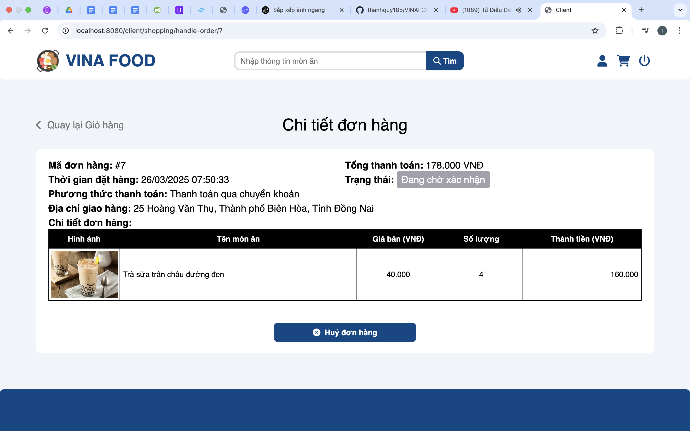

# 🍴 VINAFOOD - Website quản lý cửa hàng bán món ăn

---

## 📌 Giới thiệu

Đồ án cá nhân dùng để học và hiểu về từng bước xây dựng và phát triển một website có sử dụng Java Spring và được xây dựng theo mô hình MVC. Vì là đồ án dùng để học Java Spring nên còn nhiều hạn chế.

<p><br></p>

## 🖼️ Giao diện

<!-- <p align="center">
  
  <br>
  <em>Hình 1: Giao diện đăng nhập</em>
</p>

<p align="center">
  
  <br>
  <em>Hình 2: Giao diện đăng ký</em>
</p> -->

<table>
  <tr>
    <td width="50%" align="center">
      
      <br>
      <em>Hình 1: Giao diện đăng nhập</em>
    </td>
    <td width="50%" align="center">
      
      <br>
      <em>Hình 2: Giao diện đăng ký</em>
    </td>
  </tr>
  <tr>
    <td width="50%" align="center">
      
      <br>
      <em>Hình 3: Giao diện danh sách món ăn</em>
    </td>
    <td width="50%" align="center">
      
      <br>
      <em>Hình 4: Giao diện chi tiết món ăn (Còn hàng)</em>
    </td>
  </tr>
  <tr>
    <td width="50%" align="center">
      
      <br>
      <em>Hình 5: Giao diện thông tin người dùng</em>
    </td>
    <td width="50%" align="center">
      
      <br>
      <em>Hình 6: Giao diện thông tin mua hàng</em>
    </td>
  </tr>
  <tr>
    <td width="50%" align="center">
      
      <br>
      <em>Hình 7: Giao diện thanh toán</em>
    </td>
    <td width="50%" align="center">
      
      <br>
      <em>Hình 8: Giao diện thanh toán (thay đổi địa chỉ giao hàng)</em>
    </td>
  </tr>
  <tr>
    <td width="50%" align="center">
      
      <br>
      <em>Hình 9: Giao diện chi tiết đơn hàng</em>
    </td>
    <td width="50%" align="center">
      
      <br>
      <em>Hình 10: Giao diện trang 403</em>
    </td>
  </tr>
</table>

<p><br></p>

## 🚀 Chức năng chính

- Tìm kiếm và lọc dữ liệu theo nhiều tiêu chí
- Quản lý thông tin sản phẩm, đơn hàng, người dùng
- Xuất hóa đơn / báo cáo dưới dạng PDF
- Đăng nhập, đăng ký, phân quyền tài khoản
- ...

<p><br></p>

## 🛠️ Công nghệ sử dụng

- **Frontend:** HTML, CSS (SASS), JavaScript, Thymeleaf
- **Backend:** Java Spring (Spring Boot, Spring MVC, Spring Security, Spring Data JPA)
- **Database:** MySQL

<p><br></p>

## ❌ Điểm hạn chế

- Giao diện đơn giản, không bắt mắt
- Chưa xử lý việc khi người dùng quên mật khẩu
- Chưa xử lý việc khi người dùng đăng nhập bằng các tài khoản: Facebook, Google
- Chưa xử lý tốt nghiệp vụ bán hàng
- Reload trang liên tục
- Chưa tính hợp thanh toán bằng VNPAY
- ...

**_Ghi chú:_** _Vì là đồ án mục đích chính là dùng để học Java Spring nên còn vài tác vụ chưa xử lý tốt_

<p><br></p>

## ⚙️ Hướng dẫn cài đặt & chạy ứng dụng

```bash
# Clone đồ án
git clone https://github.com/thanhquy185/VINAFOOD_Thymeleaf.git

# Chạy ứng dụng (dev mode)
mvn spring-boot:run
```

<p align="center">
  💡 <em>Trường Đại học Sài Gòn – Khoa Công nghệ Thông tin</em>  
  <br>
  📆 <em>Học kỳ 2 – Năm học 2024–2025</em>
</p>
